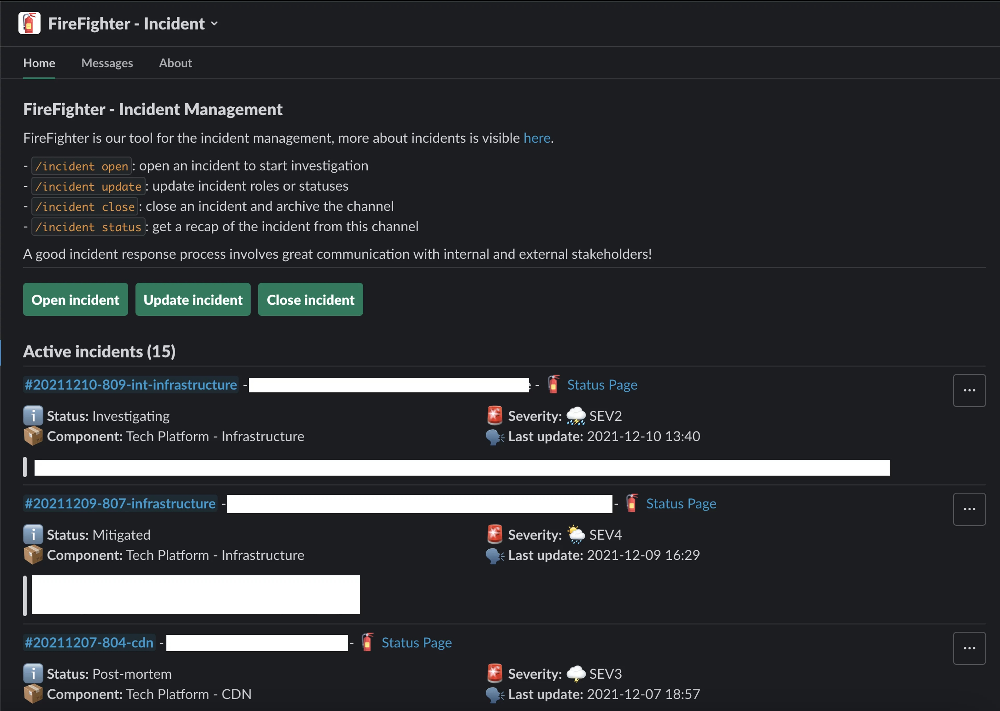

# FireFighter

     

FireFighter is ManoMano's in-house Incident Management Tool.

It helps manage incidents, by automatically creating a Slack channel for communication, integrating with Jira (with P1-P5 priority mapping), and much more.

__What's Incident Management?__

Incident Management is a set of processes and tools to help teams detect, respond to, and resolve incidents quickly and effectively.

Incidents are unplanned interruptions or reductions in quality of services, like a service outage or a security breach.

<!--intro-end-->

## Learn more

Check out our [documentation](https://manomanotech.github.io/firefighter-incident/latest/) for more details.

## Contributing

See [our Contribution Guide](https://manomanotech.github.io/firefighter-incident/latest/contributing/) for details on submitting patches, the contribution workflow and developer's guide.

## License

FireFighter is under the MIT license. See the [LICENSE](LICENSE) file for details.
