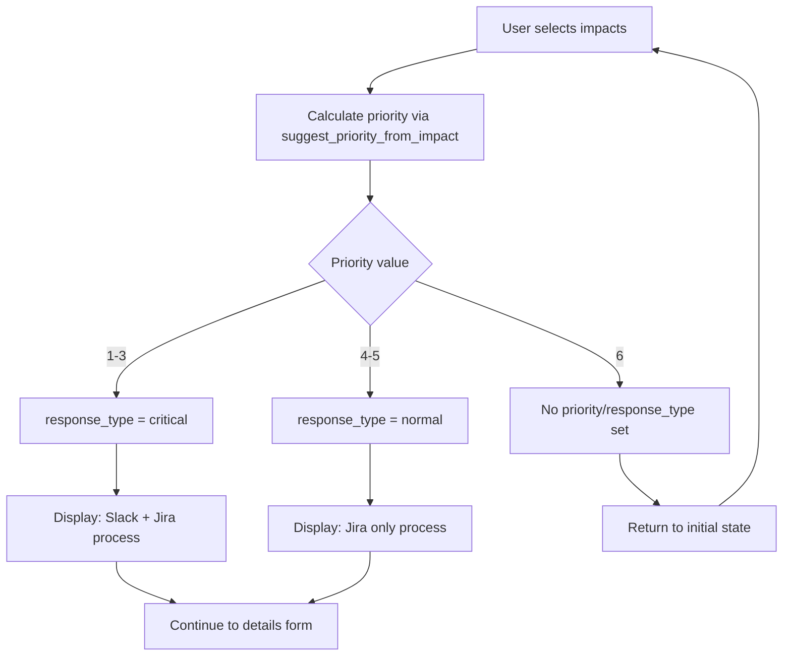

# Slack UX Improvements - Developer Documentation

## Overview

This document details the UX improvements made to the Slack incident creation workflow in June 2025, specifically the removal of manual Critical/Normal button selection in favor of automatic response type calculation.

## Problem Statement

### Previous Workflow Issues

The original Slack incident creation workflow had a redundant step where users manually selected between "Critical" and "Normal" response types after already selecting impact levels:

1. **User selects impacts** → System calculates priority (P1-P5)
2. **User selects Critical/Normal** → Manual choice that could conflict with calculated priority
3. **User fills details** → Additional incident information
4. **Incident created** → Final step

### Issues Identified

- **Redundancy**: Priority was already calculated from impacts, making manual selection unnecessary
- **Inconsistency Risk**: Users could select "Normal" for P1 incidents or "Critical" for P5 incidents
- **User Confusion**: Extra step that didn't add value to the workflow
- **Error Prone**: Manual selection could override logical priority-based decisions

## Solution Implemented

### Automatic Response Type Calculation

The system now automatically determines the response type based on calculated priority:

```python
def _calculate_proposed_incident_type(suggested_priority_value: int) -> ResponseType:
    return "critical" if suggested_priority_value <= 3 else "normal"
```

**Mapping:**
- **P1, P2, P3** → `critical` → Slack channel + Jira ticket
- **P4, P5** → `normal` → Jira ticket only

### New Streamlined Workflow

1. **User selects impacts** → System calculates priority AND response type
2. **System displays summary** → Priority, SLA, process, and impacts shown
3. **User fills details** → Additional incident information
4. **Incident created** → Final step

## Technical Implementation

### Files Modified

#### `src/firefighter/slack/views/modals/open.py`

**Removed:**
- Button generation in `_build_response_type_blocks()`
- Action handlers `incident_open_set_res_type_critical` and `incident_open_set_res_type_normal`
- `ActionsBlock` import and usage

**Maintained:**
- Priority/SLA/process summary display
- All incident creation logic
- Form validation and error handling

```python
# Before: Generated buttons for manual selection
elements: list[ButtonElement] = []
for response_type in response_types:
    button = ButtonElement(
        text=text,
        action_id=f"incident_open_set_res_type_{response_type}",
        # ...
    )
    elements.append(button)
blocks: list[Block] = [ActionsBlock(elements=elements)]

# After: Direct summary display without buttons
blocks: list[Block] = []
if impact_form_data := open_incident_context.get("impact_form_data"):
    # Display summary directly
```

#### `src/firefighter/slack/views/modals/opening/select_impact.py`

**Enhanced:**
- Handling for "no impact selected" case (priority value 6)
- Automatic return to initial state when all impacts are "N/A"
- Better error handling for priority calculations

```python
# Handle no impacts selected
if suggested_priority_value == 6:  # LevelChoices.NONE.priority
    return OpeningData(
        priority=None,
        response_type=None,
        # ...
    )
```

### Data Flow



## Error Handling

### Mixed Data Types Fix

**Problem:** Impact descriptions could be stored as string IDs or `ImpactLevel` objects, causing `AttributeError` when accessing `.name` or `.description`.

**Solution:** Automatic type detection and conversion:

```python
# In both _get_impact_descriptions() and extract_descriptions()
if isinstance(value, str):
    try:
        value = ImpactLevel.objects.get(pk=value)
    except ImpactLevel.DoesNotExist:
        continue

if hasattr(value, 'name') and value.name != "NO":
    # Safe processing
```

### Priority Validation

**Problem:** Calculated priority might not exist in database.

**Solution:** Fallback mechanism with error logging:

```python
try:
    priority = Priority.objects.get(value=suggested_priority_value)
except Priority.DoesNotExist:
    logger.error(f"Priority with value {suggested_priority_value} does not exist")
    priority = Priority.objects.filter(value__gte=3).first()
```

## Test Environment Support

### Configuration

New environment variables for test environments without Slack usergroups:

```bash
TEST_MODE=True
ENABLE_SLACK_USERGROUPS=False
```

### Implementation

Modified `get_invites_from_slack()` signals to skip usergroup invitations in test mode:

```python
test_mode = os.getenv("TEST_MODE", "False").lower() == "true"
usergroups_enabled = os.getenv("ENABLE_SLACK_USERGROUPS", "True").lower() == "true"

if test_mode and not usergroups_enabled:
    logger.info("Test mode: Skipping Slack usergroup invitations")
    return []
```

## Benefits

### User Experience
- **33% reduction in workflow steps** (from 4 to 3)
- **Eliminated decision fatigue** - one less choice to make
- **Faster incident creation** - especially beneficial during high-stress situations
- **Consistent behavior** - priority always matches process

### Technical Benefits
- **Reduced code complexity** - fewer action handlers and modal states
- **Better error resilience** - automatic handling of edge cases
- **Improved testability** - deterministic behavior based on inputs
- **Maintainability** - fewer code paths to maintain

### Business Benefits
- **Reduced user errors** - no more priority/process mismatches
- **Faster incident response** - streamlined creation workflow
- **Better data consistency** - automatic priority-process alignment
- **Improved user adoption** - simpler, more intuitive workflow

## Migration and Compatibility

### Backward Compatibility
- ✅ **No database changes required**
- ✅ **Existing incidents unaffected**
- ✅ **API endpoints unchanged**
- ✅ **External integrations preserved**

### Testing Strategy
1. **Unit tests** for priority calculation logic
2. **Integration tests** for Slack workflow
3. **End-to-end tests** for complete incident creation
4. **Error handling tests** for edge cases

### Rollback Plan
If issues arise, the previous behavior can be restored by:
1. Reverting the three modified files
2. Re-adding the action handlers
3. Restoring button generation logic

## Future Enhancements

### Potential Improvements
1. **Web UI alignment** - Apply same automatic logic to web interface
2. **Custom overrides** - Allow manual override in special cases
3. **Analytics integration** - Track UX improvement metrics
4. **Mobile optimization** - Optimize for mobile Slack clients

### Monitoring
- **Error rates** - Monitor for new error patterns
- **User feedback** - Collect user satisfaction metrics
- **Performance** - Ensure no regression in response times
- **Usage patterns** - Analyze workflow completion rates

## References

- [GitHub Issue: Remove Critical/Normal buttons](https://github.com/ManoManoTech/firefighter-incident/issues/xxx)
- [Slack Block Kit Documentation](https://api.slack.com/block-kit)
- [FireFighter Priority System Documentation](./priority-system.md)
