# Incident Closure Workflow

This document describes the complete incident closure workflow in FireFighter, including the different paths and requirements for closing incidents based on priority and status.

**Implementation Status**: ✅ **COMPLETED** (October 3, 2025)
**Branch**: `feat/direct-incident-closure`
**Testing**: 335 tests passing with comprehensive coverage

## Overview

FireFighter supports multiple ways to close incidents, with different requirements based on the incident's priority level and current status. The workflow ensures that critical incidents (P1/P2) follow proper post-mortem procedures, while allowing more streamlined closure for lower priority incidents.

## Workflow Diagram

The following diagram shows the complete incident closure workflow:

```mermaid
graph TD
    A[Incident Created] --> B[Opened]
    B --> C[Investigating]
    C --> D[Mitigating]
    D --> E[Mitigated]

    %% P1/P2 PRD Path (Post-mortem Required)
    E --> F{P1/P2 in PRD?}
    F -->|Yes| G[Post-mortem]
    G --> H[Closed]

    %% P3+ Path (No Post-mortem Required)
    F -->|No| H

    %% Closure with Reason (Any Priority)
    B -->|Reason Required| I[Closure Reason Form]
    C -->|Reason Required| I
    I --> H

    %% Normal Workflow Closure
    E -->|Normal Close| H
    G -->|Normal Close| H

    %% Status Labels
    B[Opened<br/>⚠️ Reason required for closure]
    C[Investigating<br/>⚠️ Reason required for closure]
    D[Mitigating]
    E[Mitigated]
    G[Post-mortem<br/>✅ Can close normally]
    H[Closed<br/>📁 Channel archived]
    I[Closure Reason<br/>🗃️ Mandatory form]
```



## Closure Methods

### 1. Normal Workflow Closure

**Path**: `Mitigated` → `Closed` (or `Post-mortem` → `Closed` for P1/P2)

- **When**: Incident has been properly resolved through the normal workflow
- **Requirements**:
  - Status must be `Fixed` or higher
  - For P1/P2 in PRD: Must complete post-mortem first
- **Triggered via**:
  - `/incident close` command
  - Update status to "Closed" (when allowed)

### 2. Closure with Reason

**Path**: `Opened/Investigating` → `Closure Reason Form` → `Closed`

- **When**: Incident needs to be closed without following the complete workflow
- **Use cases**:
  - Duplicate incidents
  - False alarms
  - No actual anomaly
  - User error
- **Requirements**:
  - Mandatory closure reason selection
  - Optional reference to related incident/link
  - Closure message explaining the decision
- **Triggered via**:
  - `/incident close` command (shows reason form automatically)
  - Update status to "Closed" from early statuses (shows reason form automatically)

## Priority-Based Rules

### P1/P2 Incidents in PRD Environment

- **Post-mortem Required**: Must complete post-mortem before normal closure
- **Workflow**: `Fixed` → `Post-mortem` → `Closed`
- **Direct Closure**: Still available from `Opened/Investigating` with reason

### P3/P4/P5 Incidents

- **Post-mortem Optional**: Can close directly from `Fixed` status
- **Workflow**: `Fixed` → `Closed`
- **Direct Closure**: Available from `Opened/Investigating` with reason

## Status Restrictions

### From "Opened" or "Investigating"

- ❌ **Cannot close normally** without reason
- ✅ **Can close with reason** (mandatory closure reason form)
- **All priorities** follow the same rule

### From "Mitigating" or "Mitigated"

- ✅ **Can close normally** (P3+ incidents)
- ❌ **Cannot close normally** (P1/P2 in PRD - must go through post-mortem)

### From "Post-mortem"

- ✅ **Can close normally** (all priorities)

## Closure Reason Types

When closing with a reason, the following options are available:

- **DUPLICATE**: Duplicate of another incident
- **FALSE_POSITIVE**: False alarm - no actual issue
- **SUPERSEDED**: Superseded by another incident
- **EXTERNAL**: External dependency/known issue
- **CANCELLED**: Cancelled - no longer relevant

*Note: "RESOLVED" is excluded from early closure reasons as it's reserved for normal workflow closure only.*

## Technical Implementation

### Key Components

1. **UpdateStatusForm.requires_closure_reason()**: Determines when closure reason is needed
   - Location: `src/firefighter/incidents/forms/update_status.py`
   - Coverage: 97%

2. **IncidentClosureReasonForm**: Handles closure reason input
   - Location: `src/firefighter/incidents/forms/closure_reason.py`
   - Coverage: 93%

3. **ClosureReason Enum**: Defines available closure reasons
   - Location: `src/firefighter/incidents/enums.py`
   - Coverage: 100%

4. **Modal Utils**: Circular import resolution and modal routing
   - Location: `src/firefighter/slack/views/modals/utils.py`
   - Coverage: 100%

5. **Slack Integration**: Modal handlers for closure reason collection
   - Close Modal: Redirects to reason form when needed
   - Update Status Modal: Shows reason form for early closure attempts

### Form Validation

```python
@staticmethod
def requires_closure_reason(incident: Incident, target_status: IncidentStatus) -> bool:
    """Check if closing this incident to the target status requires a closure reason."""
    if target_status != IncidentStatus.CLOSED:
        return False

    current_status = incident.status

    # Require reason if closing from Opened or Investigating (for any priority)
    return current_status.value in [IncidentStatus.OPEN, IncidentStatus.INVESTIGATING]
```

### Database Fields

Closure reason information is stored in the incident model:

- `closure_reason`: Selected reason code (ClosureReason enum)
- `closure_reference`: Optional reference to related incident or external link

## User Experience

### Slack Commands

- **`/incident close`**:
  - Shows normal close form if status allows
  - Shows closure reason form if closing from early status
  - Shows error message if prerequisites not met

- **`/incident update`**:
  - Shows normal update form
  - Intercepts "Closed" selection from early statuses
  - Automatically pushes closure reason form when needed

### Modal Flow

1. User attempts to close incident
2. System checks current status and requirements
3. Routes to appropriate modal:
   - Normal close form (if status allows)
   - Closure reason form (if early status)
   - Error message (if prerequisites not met)

## Benefits

- **Streamlined Process**: Single workflow for all closure scenarios
- **Proper Documentation**: Reasons captured for audit and analysis
- **Flexibility**: Supports both rigorous and quick closure paths
- **Consistency**: Same logic applies across all interfaces
- **User-Friendly**: Automatic detection and routing to correct form

## Testing Coverage

The implementation includes comprehensive test coverage across all components:

### Test Files
- `tests/test_incidents/test_forms/test_workflow_transitions.py` - Complete workflow testing
- `tests/test_incidents/test_forms/test_closure_reason.py` - Form validation testing
- `tests/test_incidents/test_enums.py` - Enum method testing
- `tests/test_slack/views/modals/test_utils.py` - Utility function testing

### Test Scenarios
- ✅ P1/P2 workflow enforcement (post-mortem required)
- ✅ P3+ workflow flexibility (direct closure allowed)
- ✅ Closure reason requirement detection
- ✅ Form validation and choices
- ✅ Modal routing logic
- ✅ Status transition validation
- ✅ Edge cases and error handling

### Quality Metrics
- **Tests**: 335 passing (0 failed)
- **Coverage**: 93-100% on all modified files
- **Type checking**: 0 MyPy errors
- **Linting**: 0 Ruff errors
- **Pre-commit**: All hooks passing

## Migration Notes

This workflow replaces the previous "direct-close" command with a unified approach:

- **Removed**: Separate direct-close command and modal
- **Enhanced**: Existing close and update commands with intelligent routing
- **Preserved**: All existing closure capabilities with better UX
- **Added**: Comprehensive test coverage and quality enforcement

## Future Enhancements

Potential future improvements to consider:

1. **Analytics Integration**: Track closure reason usage for insights
2. **Automated Suggestions**: Suggest closure reasons based on incident content
3. **Workflow Customization**: Allow organization-specific workflow rules
4. **Integration Testing**: End-to-end Slack workflow testing
5. **Performance Optimization**: Cache workflow rules for better performance
