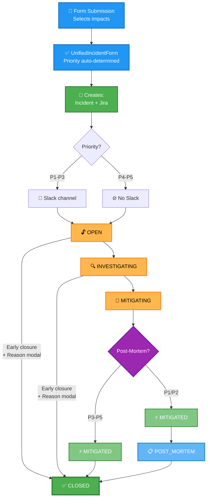

# Incident Workflow

> All priorities (P1-P5) follow the same workflow. Differences are in Slack channels and post-mortem requirements.

---

## Complete Workflow



---

## Key Differences

| | P1-P3 | P4-P5 | P1/P2 |
|---|---|---|---|
| Incident object | ✅ | ✅ | ✅ |
| Jira ticket | ✅ | ✅ | ✅ |
| Slack channel | ✅ | ❌ | ✅ |
| Post-mortem | ✅ | ❌ | ✅ |
| Form fields | Base | Base + team_routing + optional | Base |

---

## Implementation

See [incident-workflows.md](incident-workflows.md) for technical details on form and signals.

---

## Post-Mortem (PM) - P1/P2 Only

When incident reaches `MITIGATED` status (P1/P2 incidents):

```
User clicks "Create post-mortem" in Slack
    ↓
PostMortemManager checks enabled backends
    ├─ Confluence? → Create Confluence page
    └─ JIRA? → Create JIRA issue with templates
    ↓
Auto-assign to incident commander (if they have JIRA account)
    ↓
Notify Slack channel with link
    ↓
User manually completes PM (retrospective notes)
    ↓
User transitions incident: POST_MORTEM → CLOSED
```

**Deployment modes**:
- Confluence only (legacy)
- JIRA only (target)
- Both (migration/dual)

See [jira-postmortem.md](jira-postmortem.md) for configuration and troubleshooting.

---

## Related

- **JIRA Post-Mortem**: [jira-postmortem.md](jira-postmortem.md) - Configuration & setup
- **JIRA Sync**: [jira-integration.md](jira-integration.md) - Incident↔JIRA sync
- **Signals & Handlers**: [incident-workflows.md](incident-workflows.md) (technical deep-dive)
