# Incident Workflow

> All priorities (P1-P5) follow the same workflow. Differences are in Slack channels and post-mortem requirements.

---

## Complete Workflow

```mermaid
graph TD
    A["📝 User submits form<br/>Selects impacts<br/>Priority auto-determined"] --> B["✅ UnifiedIncidentForm<br/>(same for P1-P5)"]

    B --> C["📌 Creates:<br/>• Incident object<br/>• Jira ticket"]
    C --> D{Priority?}

    D -->|P1-P3| E["📱 Slack channel<br/>created"]
    D -->|P4-P5| F["No Slack channel"]

    E --> G["🔀 Status Transitions"]
    F --> G

    G --> H{Post-Mortem<br/>Required?}
    H -->|P1/P2| I["OPEN → INVESTIGATING<br/>↓<br/>MITIGATING ↓ MITIGATED<br/>↓<br/>POST_MORTEM"]
    H -->|P3-P5| J["OPEN → INVESTIGATING<br/>↓<br/>MITIGATING ↓ MITIGATED"]

    I --> K{How to close?}
    J --> K

    K -->|Normal closure| L["From MITIGATED<br/>(or POST_MORTEM)<br/>→ CLOSED"]
    K -->|Early closure| M["From OPEN or<br/>INVESTIGATING +<br/>Reason modal<br/>→ CLOSED"]

    L --> N["✅ Incident CLOSED"]
    M --> N

    style A fill:#e1f5ff
    style N fill:#c8e6c9
    style I fill:#fff9c4
    style J fill:#fff9c4
```

---

## Key Differences

| | P1-P3 | P4-P5 | P1/P2 |
|---|---|---|---|
| Incident object | ✅ | ✅ | ✅ |
| Jira ticket | ✅ | ✅ | ✅ |
| Slack channel | ✅ | ❌ | ✅ |
| Post-mortem | ✅ | ❌ | ✅ |
| Form fields | Base | Base + team_routing + optional | Base |

---

## Implementation

See [incident-workflows.md](incident-workflows.md) for technical details on form and signals.

---

## Related

- **JIRA Sync**: [jira-integration.md](jira-integration.md)
- **Signals & Handlers**: [incident-workflows.md](incident-workflows.md) (technical deep-dive)
