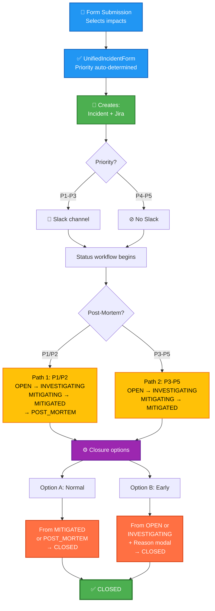

# Incident Workflow

> All priorities (P1-P5) follow the same workflow. Differences are in Slack channels and post-mortem requirements.

---

## Complete Workflow

```mermaid
graph TD
    A["📝 Form Submission<br/>Selects impacts"] --> B["✅ UnifiedIncidentForm<br/>Priority auto-determined"]

    B --> C["📌 Creates:<br/>Incident + Jira"]
    C --> D{Priority?}

    D -->|P1-P3| E["📱 Slack channel"]
    D -->|P4-P5| F["⊘ No Slack"]

    E --> G["Status workflow begins"]
    F --> G

    G --> H{Post-Mortem?}
    H -->|P1/P2| I["Path 1: P1/P2<br/>OPEN → INVESTIGATING<br/>MITIGATING → MITIGATED<br/>→ POST_MORTEM"]
    H -->|P3-P5| J["Path 2: P3-P5<br/>OPEN → INVESTIGATING<br/>MITIGATING → MITIGATED"]

    I --> K["⚙️ Closure options"]
    J --> K

    K --> L["Option A: Normal"]
    K --> M["Option B: Early"]

    L --> L1["From MITIGATED<br/>or POST_MORTEM<br/>→ CLOSED"]
    M --> M1["From OPEN or<br/>INVESTIGATING<br/>+ Reason modal<br/>→ CLOSED"]

    L1 --> O["✅ CLOSED"]
    M1 --> O

    style A fill:#2196F3,stroke:#1565C0,stroke-width:2px,color:#fff
    style B fill:#2196F3,stroke:#1565C0,stroke-width:2px,color:#fff
    style C fill:#4CAF50,stroke:#2E7D32,stroke-width:2px,color:#fff
    style I fill:#FFC107,stroke:#F57F17,stroke-width:2px,color:#000
    style J fill:#FFC107,stroke:#F57F17,stroke-width:2px,color:#000
    style L1 fill:#FF7043,stroke:#D84315,stroke-width:2px,color:#fff
    style M1 fill:#FF7043,stroke:#D84315,stroke-width:2px,color:#fff
    style O fill:#4CAF50,stroke:#2E7D32,stroke-width:3px,color:#fff
    style K fill:#9C27B0,stroke:#6A1B9A,stroke-width:2px,color:#fff
```

---

## Key Differences

| | P1-P3 | P4-P5 | P1/P2 |
|---|---|---|---|
| Incident object | ✅ | ✅ | ✅ |
| Jira ticket | ✅ | ✅ | ✅ |
| Slack channel | ✅ | ❌ | ✅ |
| Post-mortem | ✅ | ❌ | ✅ |
| Form fields | Base | Base + team_routing + optional | Base |

---

## Implementation

See [incident-workflows.md](incident-workflows.md) for technical details on form and signals.

---

## Related

- **JIRA Sync**: [jira-integration.md](jira-integration.md)
- **Signals & Handlers**: [incident-workflows.md](incident-workflows.md) (technical deep-dive)
