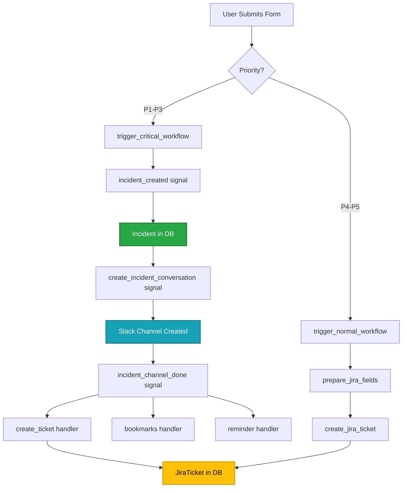

# Incident Workflows - Signal Architecture

> Technical reference for signal flows and handlers. For workflow overview, see [incident-workflow.md](incident-workflow.md).

---

## Overview

FireFighter uses Django signals to decouple incident creation steps:

```
User submits form
    ↓
UnifiedIncidentForm triggers workflow
    ├─ incident_created signal
    ├─ create_incident_conversation signal (P1-P3 only)
    └─ incident_channel_done signal
```

---

## Available Signals

| Signal | Sent When | Handlers |
|--------|-----------|----------|
| `incident_created` | Incident object created | Profile handlers in `src/firefighter/incidents/signals.py` |
| `incident_updated` | Incident status/fields changed | Profile handlers in `src/firefighter/incidents/signals.py` |
| `incident_key_events_updated` | Key events modified | Profile handlers in `src/firefighter/incidents/signals.py` |
| `incident_closed` | Incident marked CLOSED | Profile handlers in `src/firefighter/incidents/signals.py` |
| `postmortem_created` | Post-mortem created | Profile handlers in `src/firefighter/incidents/signals.py` |
| `get_invites` | Retrieving responders to invite | Profile handlers in `src/firefighter/incidents/signals.py` |
| `create_incident_conversation` | Creating Slack channel (P1-P3) | See `src/firefighter/slack/signals/` |
| `incident_channel_done` | Slack channel ready (P1-P3) | See `src/firefighter/slack/signals/` |

---

## Signal Flow Diagram



---

## Implementation References

### Core Files

- **Form**: `src/firefighter/incidents/forms/unified_incident.py` - `UnifiedIncidentForm`
- **Signals**: `src/firefighter/incidents/signals.py` - Signal definitions
- **Slack Handlers**: `src/firefighter/slack/signals/` - Channel creation handlers
- **RAID Handlers**: `src/firefighter/raid/signals/` - JIRA creation handlers

### Key Methods

- `UnifiedIncidentForm.trigger_incident_workflow()` - Workflow entry point
- `Incident.objects.declare()` - Create incident object
- `jira_client.create_issue()` - Create Jira ticket

---

## Related Documentation

- [Incident Workflow](./incident-workflow.md) - Complete workflow overview
- [JIRA Integration](./jira-integration.md) - Sync details
- [Architecture Overview](./overview.md) - Project structure

