# Incident Creation Workflows & Signal Architecture

This document provides a comprehensive overview of the incident creation workflows, signal flows, and event chains in FireFighter.

## Table of Contents

- [Overview](#overview)
- [Signal Architecture](#signal-architecture)
- [Current Workflow: P1-P3 (Critical Incidents)](#current-workflow-p1-p3-critical-incidents)
- [Current Workflow: P4-P5 (Normal Incidents)](#current-workflow-p4-p5-normal-incidents)
- [Signal Handlers Overview](#signal-handlers-overview)
- [Key Differences Between Workflows](#key-differences-between-workflows)
- [Future: Unified Workflow Design](#future-unified-workflow-design)

---

## Overview

FireFighter currently implements **two distinct workflows** for incident creation, based on priority:

- **P1-P3 (Critical)**: Creates `Incident` → Creates Slack Channel → Creates Jira Ticket
- **P4-P5 (Normal)**: Creates only `JiraTicket` (no `Incident` in database)

This design means P4-P5 incidents **do not appear** in the `/incident/` web UI list view, as they don't exist as `Incident` objects.

---

## Signal Architecture

### Available Signals

FireFighter uses Django signals to decouple incident workflow steps. Here are all available signals:

```python
# src/firefighter/incidents/signals.py

incident_created = django.dispatch.Signal()
"""Signal sent when an incident is created
Args:
    incident (Incident): The incident that was created
"""

incident_updated = django.dispatch.Signal()
"""Signal sent when an incident is updated
Args:
    sender (str): The sender identifier (e.g., "update_status", "update_roles")
    incident (Incident): The incident that was updated
    incident_update (IncidentUpdate): The incident update that was created
    updated_fields (list[str]): The fields that were updated
    old_priority (Priority, optional): The old priority if changed
"""

incident_key_events_updated = django.dispatch.Signal()
"""Signal sent when an incident's key events are updated
Args:
    incident (Incident): The incident whose key events were updated
"""

incident_closed = django.dispatch.Signal()
"""Signal sent when an incident is closed
Args:
    sender (Any): The sender identifier
    incident (Incident): The incident that was closed
"""

postmortem_created = django.dispatch.Signal()
"""Signal sent when a postmortem is created
Args:
    sender (str): The sender identifier
    incident (Incident): The incident for which postmortem was created
"""

get_invites = django.dispatch.Signal()
"""Signal sent to retrieve the list of users to invite
Args:
    incident (Incident): The incident for which to retrieve invites
Returns:
    users (list[User]): The list of users to invite
"""

create_incident_conversation = django.dispatch.Signal()
"""Signal sent to create a Slack conversation for an incident
Args:
    incident (Incident): The incident for which to create conversation
"""
```

```python
# src/firefighter/slack/signals/__init__.py

incident_channel_done = django.dispatch.Signal()
"""Signal sent when Slack channel creation is complete
Args:
    incident (Incident): The incident
    channel (IncidentChannel): The created Slack channel
    **kwargs: Additional context (jira_extra_fields, impacts_data, etc.)
"""
```

### Signal Flow Diagram


---

## Current Workflow: P1-P3 (Critical Incidents)

### Overview

Critical incidents (P1-P3) follow a **complete workflow** that creates:
1. An `Incident` object in the database
2. A Slack channel for communication
3. A Jira ticket linked to the incident

### Step-by-Step Flow


### Code Implementation

**File**: `src/firefighter/incidents/forms/unified_incident.py` (Lines 305-352)

```python
def _trigger_critical_incident_workflow(
    self,
    creator: User,
    impacts_data: dict[str, ImpactLevel],
) -> None:
    """Create a critical incident (P1-P3) with Slack channel and roles.

    Workflow:
    1. Create Incident in database
    2. Signal: create_incident_conversation → Creates Slack channel
    3. Signal: incident_channel_done → Creates Jira ticket + setup channel
    """
    # Prepare cleaned data
    cleaned_data_copy = dict(self.cleaned_data)

    # Handle multi-environment: store all in custom_fields
    environments = cleaned_data_copy.pop("environment", [])
    if isinstance(environments, list) and environments:
        cleaned_data_copy["environment"] = environments[0]
        cleaned_data_copy.setdefault("custom_fields", {})
        cleaned_data_copy["custom_fields"]["environments"] = [env.value for env in environments]

    # Step 1: Create Incident in DB
    incident = Incident.objects.declare(created_by=creator, **cleaned_data_copy)

    # Prepare Jira extra fields (passed to signal handlers)
    jira_extra_fields = {
        "zendesk_ticket_id": self.cleaned_data.get("zendesk_ticket_id", ""),
        "seller_contract_id": self.cleaned_data.get("seller_contract_id", ""),
        "zoho_desk_ticket_id": self.cleaned_data.get("zoho_desk_ticket_id", ""),
        "is_key_account": self.cleaned_data.get("is_key_account"),
        "is_seller_in_golden_list": self.cleaned_data.get("is_seller_in_golden_list"),
        "platforms": [p.value for p in self.cleaned_data.get("platform", [])],
        "environments": [env.value for env in environments] if environments else [],
    }

    # Step 2: Signal to create Slack channel
    # This will trigger:
    # - Slack channel creation
    # - incident_channel_done signal → Jira ticket creation
    create_incident_conversation.send(
        "incident_created",
        incident=incident,
        jira_extra_fields=jira_extra_fields,
        impacts_data=impacts_data,
    )
```

### Signal Handlers Triggered

#### 1. `create_incident_conversation` Signal

**Handler**: Creates Slack channel and triggers `incident_channel_done`

**Location**: Slack channel creation logic

#### 2. `incident_channel_done` Signal

Multiple handlers listen to this signal:

##### Handler: `create_ticket()`
**File**: `src/firefighter/raid/signals/incident_created.py` (Lines 28-136)

```python
@receiver(signal=incident_channel_done)
def create_ticket(
    sender: Any, incident: Incident, channel: IncidentChannel, **kwargs: Any
) -> JiraTicket:
    # Extract context from kwargs
    jira_extra_fields = kwargs.get("jira_extra_fields", {})
    impacts_data = kwargs.get("impacts_data", {})

    # Get Jira user
    jira_user = get_jira_user_from_user(incident.created_by)

    # Build enhanced description
    description = f"""{incident.description}

🧯 This incident has been created for a critical incident.
📦 Incident category: {incident.incident_category.name}
{incident.priority.emoji} Priority: {incident.priority.name}
"""

    # Get all environments (multi-environment support)
    environments = jira_extra_fields.get("environments") or \
                   incident.custom_fields.get("environments", []) or \
                   [incident.environment.value]

    platforms = jira_extra_fields.get("platforms", ["platform-All"])

    # Prepare Jira fields using common function
    jira_fields = prepare_jira_fields(
        title=incident.title,
        description=description,
        priority=incident.priority.value,
        reporter=jira_user.id,
        incident_category=incident.incident_category.name,
        environments=environments,
        platforms=platforms,
        impacts_data=impacts_data,
        optional_fields={
            "zendesk_ticket_id": jira_extra_fields.get("zendesk_ticket_id", ""),
            "seller_contract_id": jira_extra_fields.get("seller_contract_id", ""),
            "zoho_desk_ticket_id": jira_extra_fields.get("zoho_desk_ticket_id", ""),
            "is_key_account": jira_extra_fields.get("is_key_account"),
            "is_seller_in_golden_list": jira_extra_fields.get("is_seller_in_golden_list"),
        },
    )

    # Create Jira issue
    issue = client.create_issue(**jira_fields)

    # Add watchers and links
    client.jira.add_watcher(issue=issue_id, watcher=jira_user.id)
    client.jira.add_simple_link(issue=issue_id, object={"url": incident.status_page_url, ...})
    client.jira.add_simple_link(issue=issue_id, object={"url": channel.link, ...})

    # Create JiraTicket in DB, linked to Incident
    jira_ticket = JiraTicket.objects.create(**issue, incident=incident)

    # Add Jira bookmark to Slack channel
    channel.add_bookmark(title="Jira ticket", link=jira_ticket.url, emoji=":jira_new:")

    # Send announcement in channel
    channel.send_message_and_save(SlackMessageIncidentDeclaredAnnouncement(incident))

    return jira_ticket
```

##### Handler: `incident_channel_done_bookmarks()`
**File**: `src/firefighter/slack/signals/handle_incident_channel_done.py` (Lines 24-33)

```python
@receiver(signal=incident_channel_done)
def incident_channel_done_bookmarks(
    incident: Incident, channel: IncidentChannel, **kwargs: Any
) -> None:
    """Add incident page bookmark to Slack channel"""
    channel.add_bookmark(
        title="Incident Page",
        link=incident.status_page_url + "?utm_medium=...",
        emoji=SLACK_APP_EMOJI,
    )
```

##### Handler: `sev1_process_reminder()`
**File**: `src/firefighter/slack/signals/handle_incident_channel_done.py` (Lines 37-42)

```python
@receiver(incident_channel_done)
def sev1_process_reminder(
    incident: Incident, channel: IncidentChannel, **kwargs: Never
) -> None:
    """Send communication process reminder for P1 PRD incidents"""
    if incident.priority.value == 1 and incident.environment.value == "PRD":
        channel.send_message_and_save(SlackMessageIncidentComProcess(incident))
```

##### Handler: `send_roles_message_in_conversation()`
**File**: `src/firefighter/slack/signals/handle_incident_channel_done.py` (Lines 45-54)

```python
@receiver(incident_channel_done)
def send_roles_message_in_conversation(
    incident: Incident, channel: IncidentChannel, **kwargs: Any
) -> None:
    """Send initial roles message in Slack channel"""
    update_roles_message = SlackMessageIncidentRolesUpdated(
        incident=incident,
        incident_update=None,
        first_update=True,
    )
    incident.conversation.send_message_and_save(update_roles_message)
```

### Database State After P1-P3 Creation

```
incidents_incident:
  id: 123
  title: "Production API down"
  priority: P1 (value=1)
  environment: PRD
  custom_fields: {"environments": ["PRD", "STG"]}
  ...

slack_incident_channel:
  id: 1
  incident_id: 123  # OneToOne relationship
  channel_id: "C12345"
  name: "inc-123-prd-stg-production-api-down"
  ...

raid_jiraticket:
  id: 456
  incident_id: 123  # Links to Incident
  key: "INC-789"
  url: "https://jira.example.com/browse/INC-789"
  ...
```

---

## Current Workflow: P4-P5 (Normal Incidents)

### Overview

Normal incidents (P4-P5) follow a **simplified workflow** that:
1. **Does NOT** create an `Incident` object in the database
2. **Does NOT** create a Slack channel
3. **Does** create a Jira ticket directly

This means P4-P5 incidents are **invisible in the `/incident/` web UI**.

### Step-by-Step Flow


### Code Implementation

**File**: `src/firefighter/incidents/forms/unified_incident.py` (Lines 354-407)

```python
def _trigger_normal_incident_workflow(
    self,
    creator: User,
    impacts_data: dict[str, ImpactLevel],
) -> None:
    """Create a normal incident (P4-P5) with Jira ticket only.

    Workflow:
    1. Prepare Jira fields
    2. Create Jira issue via API
    3. Create JiraTicket in DB (incident=None)
    4. Send Slack notifications (DMs + raid_alert channels)

    Note: Does NOT create Incident object or Slack channel.
    """
    # Get Jira user
    jira_user = get_jira_user_from_user(creator)

    # Prepare environments and platforms
    environments = self.cleaned_data.get("environment", [])
    if isinstance(environments, list) and environments:
        environments_values = [env.value for env in environments]
    else:
        environments_values = [environments.value] if environments else []

    platforms = [p.value for p in self.cleaned_data.get("platform", [])]

    # Prepare Jira fields using common function
    jira_fields = prepare_jira_fields(
        title=self.cleaned_data["title"],
        description=self.cleaned_data["description"],
        priority=self.cleaned_data["priority"].value,
        reporter=jira_user.id,
        incident_category=self.cleaned_data["incident_category"].name,
        environments=environments_values,
        platforms=platforms,
        impacts_data=impacts_data,
        optional_fields={
            "zendesk_ticket_id": self.cleaned_data.get("zendesk_ticket_id", ""),
            "seller_contract_id": self.cleaned_data.get("seller_contract_id", ""),
            "zoho_desk_ticket_id": self.cleaned_data.get("zoho_desk_ticket_id", ""),
            "is_key_account": self.cleaned_data.get("is_key_account"),
            "is_seller_in_golden_list": self.cleaned_data.get("is_seller_in_golden_list"),
            "suggested_team_routing": self.cleaned_data.get("suggested_team_routing"),
        },
    )

    # Create Jira issue directly (no Incident object created)
    issue_data = jira_client.create_issue(**jira_fields)

    # Process Jira issue: create JiraTicket in DB (incident=None)
    process_jira_issue(
        issue_data=issue_data,
        user=creator,
        jira_user=jira_user,
        impacts_data=impacts_data,
    )
```

### Function: `process_jira_issue()`

**File**: `src/firefighter/raid/forms.py` (Lines 60-75)

```python
def process_jira_issue(
    issue_data: JiraObject,
    user: User,
    jira_user: JiraUser,
    impacts_data: dict[str, ImpactLevel],
    *args: Never,
    **kwargs: Never,
) -> None:
    """Process a Jira issue for P4-P5 incidents.

    Creates JiraTicket in DB without linking to an Incident.
    Sends Slack notifications via DM and raid_alert channels.
    """
    # Create JiraTicket in DB (incident=None)
    jira_ticket = JiraTicket.objects.create(**issue_data)

    # Save impact levels
    impacts_form = SelectImpactForm(impacts_data)
    impacts_form.save(incident=jira_ticket)

    # Set up Jira watchers
    set_jira_ticket_watchers_raid(jira_ticket)

    # Send Slack alerts (DM to creator + raid_alert channels)
    alert_slack_new_jira_ticket(jira_ticket)
```

### Function: `alert_slack_new_jira_ticket()`

**File**: `src/firefighter/raid/forms.py` (Lines 51-108)

```python
def alert_slack_new_jira_ticket(
    jira_ticket: JiraTicket,
    reporter_user: User | None = None,
    reporter_email: str | None = None,
) -> None:
    """Send Slack notifications for new P4-P5 Jira tickets.

    - Sends DM to reporter (if they have Slack enabled)
    - Posts in raid_alert channels based on priority and domain
    """
    # Validation: this is only for P4-P5 (no incident)
    if hasattr(jira_ticket, "incident") and jira_ticket.incident:
        raise ValueError("This is a critical incident, not a raid incident.")

    reporter_user = reporter_user or jira_ticket.reporter.user
    reporter_email = reporter_email or reporter_user.email
    user_domain = get_domain_from_email(reporter_email)

    # Create Slack message
    message = SlackMessageRaidCreatedIssue(jira_ticket, reporter_user=reporter_user)

    # Send DM to reporter
    if reporter_user.slack_user and reporter_user.slack_user.slack_id:
        reporter_user.slack_user.send_private_message(message, unfurl_links=False)

    # Get alert channels based on priority and domain
    channels = get_internal_alert_conversations(jira_ticket)
    if user_domain:
        channels.union(get_partner_alert_conversations(user_domain))

    # Post in all raid_alert channels
    for channel in channels:
        channel.send_message_and_save(message)
```

### Database State After P4-P5 Creation

```
incidents_incident:
  (empty - no record created)

slack_incident_channel:
  (empty - no channel created)

raid_jiraticket:
  id: 789
  incident_id: NULL  # ❌ Not linked to any Incident
  key: "SBI-123"
  url: "https://jira.example.com/browse/SBI-123"
  ...
```

---

## Signal Handlers Overview

### Summary Table

| Signal | Sender | Triggered By | Handlers | Purpose |
|--------|--------|-------------|----------|---------|
| `create_incident_conversation` | "incident_created" | P1-P3 workflow | Slack channel creation logic | Create Slack channel |
| `incident_channel_done` | N/A | After Slack channel created | `create_ticket()`<br>`incident_channel_done_bookmarks()`<br>`sev1_process_reminder()`<br>`send_roles_message_in_conversation()` | Setup channel & create Jira ticket |
| `incident_updated` | "update_status"<br>"update_roles"<br>etc. | Incident updates | `incident_updated_update_status_handler()`<br>`incident_updated_check_dowmgrade_handler()`<br>`incident_updated_update_roles_handler()`<br>`incident_updated_reinvite_handler()` | Sync Slack channel with incident changes |
| `incident_key_events_updated` | N/A | Key events form submission | `incident_key_events_updated_handler()` | Post key events message in channel |
| `incident_closed` | Various | Incident closure | Slack notification handlers | Notify about closure |
| `postmortem_created` | Various | Postmortem creation | Confluence/Slack handlers | Create postmortem doc |

### Handler Protection for Incidents Without Channels

All `incident_updated` signal handlers have been protected to handle incidents without Slack channels:

**File**: `src/firefighter/slack/signals/incident_updated.py`

```python
@receiver(signal=incident_updated, sender="update_status")
def incident_updated_update_status_handler(...) -> None:
    # Skip Slack operations for incidents without channels (e.g., P4-P5)
    if not hasattr(incident, "conversation"):
        logger.debug(f"Skipping Slack channel update for incident {incident.id} (no conversation)")
        return

    # Proceed with Slack operations...
    incident.conversation.rename_if_needed()
    incident.conversation.set_incident_channel_topic()
    # ...
```

This protection allows future support for P4-P5 incidents to be stored as `Incident` objects without requiring Slack channels.

---

## Key Differences Between Workflows

| Aspect | P1-P3 (Critical) | P4-P5 (Normal) |
|--------|------------------|----------------|
| **Incident in DB** | ✅ Created | ❌ Not created |
| **Slack Channel** | ✅ Created | ❌ Not created |
| **Jira Ticket** | ✅ Created (via signal) | ✅ Created (directly) |
| **Jira → Incident Link** | ✅ `JiraTicket.incident = incident` | ❌ `JiraTicket.incident = NULL` |
| **Roles Assignment** | ✅ Yes | ❌ No |
| **Appears in /incident/** | ✅ Yes | ❌ No |
| **Slack Notifications** | ✅ Channel messages | ⚠️ DMs + raid_alert channels only |
| **Signal Flow** | `create_incident_conversation` → `incident_channel_done` | None (direct creation) |

---

## Future: Unified Workflow Design

### Goal

Create a **single unified workflow** for all priorities (P1-P5) that:
- Always creates an `Incident` object in the database
- Conditionally creates Slack channels (P1-P3 only)
- Always creates Jira tickets (all priorities)
- Makes P4-P5 visible in `/incident/` web UI

### Proposed Unified Flow

```mermaid
sequenceDiagram
    participant User
    participant Form as UnifiedIncidentForm
    participant DB as Database
    participant Slack as Slack API
    participant Jira as Jira API

    User->>Form: Submit incident (any priority)
    Form->>Form: _trigger_unified_incident_workflow()

    Note over Form: Step 1: Always create Incident
    Form->>DB: Incident.objects.declare()
    DB-->>Form: incident object

    Note over Form: Step 2: Conditionally create Slack channel
    Form->>Form: Check priority: should_create_slack_channel()?

    alt P1-P3 (Critical)
        Form->>Form: create_incident_conversation.send(incident)
        Form->>Slack: Create channel
        Slack-->>Form: channel object
        Form->>DB: Save IncidentChannel
        Form->>Slack: Add bookmarks, send roles message, etc.
    else P4-P5 (Normal)
        Note over Form: Skip Slack channel creation
    end

    Note over Form: Step 3: Always create Jira ticket (unified)
    Form->>Form: _create_jira_ticket(incident, impacts_data)
    Form->>Form: prepare_jira_fields()
    Form->>Jira: jira_client.create_issue()
    Jira-->>Form: issue_data
    Form->>DB: JiraTicket.objects.create(incident=incident)

    alt Has Slack Channel (P1-P3)
        Form->>Slack: Add Jira bookmark to channel
        Form->>Slack: Send incident announcement
    else No Channel (P4-P5)
        Form->>Slack: Send DM to creator
        Form->>Slack: Post in raid_alert channels
    end

    Form-->>User: Incident created successfully

    Note over DB: ✅ Incident ALWAYS created (all priorities)
    Note over DB: ✅ Slack channel ONLY for P1-P3
    Note over DB: ✅ JiraTicket ALWAYS created and linked to Incident
```



### Implementation Changes Required

#### 1. Modify `UnifiedIncidentForm`

Replace two workflows with one unified workflow:

```python
def save(self, creator: User, impacts_data: dict[str, ImpactLevel]) -> Incident:
    """Unified workflow for all priorities."""
    # Step 1: Always create Incident in DB (ALL priorities)
    cleaned_data_copy = dict(self.cleaned_data)

    # Handle multi-environment
    environments = cleaned_data_copy.pop("environment", [])
    if isinstance(environments, list) and environments:
        cleaned_data_copy["environment"] = environments[0]
        cleaned_data_copy.setdefault("custom_fields", {})
        cleaned_data_copy["custom_fields"]["environments"] = [env.value for env in environments]

    incident = Incident.objects.declare(created_by=creator, **cleaned_data_copy)

    # Step 2: Conditionally create Slack channel (P1-P3 only)
    if self.should_create_slack_channel():
        self._create_slack_channel(incident, impacts_data)

    # Step 3: Always create Jira ticket (ALL priorities) - UNIFIED
    self._create_jira_ticket(incident, creator, impacts_data)

    return incident

def should_create_slack_channel(self) -> bool:
    """Determine if incident needs Slack channel based on priority."""
    priority = self.cleaned_data.get("priority")
    return priority and priority.value < 4  # P1-P3 only

def _create_slack_channel(
    self,
    incident: Incident,
    impacts_data: dict[str, ImpactLevel]
) -> None:
    """Create Slack channel for P1-P3 incidents."""
    # Signal to create Slack channel (triggers bookmarks, roles message, etc.)
    create_incident_conversation.send(
        "incident_created",
        incident=incident,
        impacts_data=impacts_data,
    )

def _create_jira_ticket(
    self,
    incident: Incident,
    creator: User,
    impacts_data: dict[str, ImpactLevel],
) -> JiraTicket:
    """Create Jira ticket for ALL priorities - UNIFIED method."""
    # Get Jira user
    jira_user = get_jira_user_from_user(creator)

    # Prepare environments and platforms
    environments = self.cleaned_data.get("environment", [])
    if isinstance(environments, list) and environments:
        environments_values = [env.value for env in environments]
    else:
        environments_values = [environments.value] if environments else []

    platforms = [p.value for p in self.cleaned_data.get("platform", [])]

    # Build description (enhanced for P1-P3, simple for P4-P5)
    if hasattr(incident, "conversation"):
        # P1-P3: Enhanced description with links
        description = f"""{incident.description}

🧯 This incident has been created for a critical incident.
📦 Incident category: {incident.incident_category.name}
{incident.priority.emoji} Priority: {incident.priority.name}
"""
    else:
        # P4-P5: Simple description
        description = incident.description

    # Prepare Jira fields using common function (UNIFIED for all priorities)
    jira_fields = prepare_jira_fields(
        title=incident.title,
        description=description,
        priority=incident.priority.value,
        reporter=jira_user.id,
        incident_category=incident.incident_category.name,
        environments=environments_values,
        platforms=platforms,
        impacts_data=impacts_data,
        optional_fields={
            "zendesk_ticket_id": self.cleaned_data.get("zendesk_ticket_id", ""),
            "seller_contract_id": self.cleaned_data.get("seller_contract_id", ""),
            "zoho_desk_ticket_id": self.cleaned_data.get("zoho_desk_ticket_id", ""),
            "is_key_account": self.cleaned_data.get("is_key_account"),
            "is_seller_in_golden_list": self.cleaned_data.get("is_seller_in_golden_list"),
            "suggested_team_routing": self.cleaned_data.get("suggested_team_routing"),
        },
    )

    # Create Jira issue via API (UNIFIED)
    issue_data = jira_client.create_issue(**jira_fields)

    # Create JiraTicket in DB, linked to Incident (UNIFIED)
    jira_ticket = JiraTicket.objects.create(**issue_data, incident=incident)

    # Save impact levels
    impacts_form = SelectImpactForm(impacts_data)
    impacts_form.save(incident=jira_ticket)

    # Set up Jira watchers
    set_jira_ticket_watchers(jira_ticket, jira_user)

    # Add Jira links
    add_jira_links(jira_ticket, incident)

    # Send Slack notifications based on channel presence
    if hasattr(incident, "conversation"):
        # P1-P3: Add bookmark and send announcement in channel
        incident.conversation.add_bookmark(
            title="Jira ticket",
            link=jira_ticket.url,
            emoji=":jira_new:",
        )
        incident.conversation.send_message_and_save(
            SlackMessageIncidentDeclaredAnnouncement(incident)
        )
    else:
        # P4-P5: Send DM and raid_alert notifications
        alert_slack_new_jira_ticket(jira_ticket)

    return jira_ticket
```

**Key improvements**:
- ✅ **Single `_create_jira_ticket()` method** for all priorities
- ✅ **Same `prepare_jira_fields()` call** for P1-P5
- ✅ **Same `JiraTicket.objects.create(incident=incident)`** for all
- ✅ **Conditional Slack notifications** based on channel presence
- ✅ **Much simpler logic** - no workflow duplication

#### 2. Remove Signal-Based Jira Creation for P1-P3

With the unified approach, **we no longer need** the `create_ticket()` signal handler:

**Before**: P1-P3 created Jira via `incident_channel_done` signal
**After**: All priorities create Jira directly in `_create_jira_ticket()`

```python
# ❌ DELETE: src/firefighter/raid/signals/incident_created.py
# The entire signal handler can be removed since Jira creation
# is now unified in UnifiedIncidentForm._create_jira_ticket()

@receiver(signal=incident_channel_done)  # ❌ No longer needed
def create_ticket(...) -> JiraTicket:
    # This entire handler can be deleted
    pass
```

#### 3. Simplify `process_jira_issue()`

This function can be **completely removed** or simplified to just a helper for Jira webhooks:

```python
# ⚠️ OPTION 1: Remove entirely (recommended)
# All logic moved to UnifiedIncidentForm._create_jira_ticket()

# ⚠️ OPTION 2: Keep only for Jira webhook processing
def process_jira_issue_from_webhook(
    issue_data: JiraObject,
    user: User,
    impacts_data: dict[str, ImpactLevel],
) -> JiraTicket:
    """Process Jira issue updates from webhooks only."""
    # Minimal logic for webhook-triggered updates
    pass
```

#### 4. Benefits of Unified Workflow

✅ **Simplified codebase**: One workflow instead of two
✅ **Single Jira creation method**: `_create_jira_ticket()` for ALL priorities
✅ **No signal-based Jira creation**: Direct call instead of `incident_channel_done` signal
✅ **Consistent data model**: All incidents in database
✅ **Better visibility**: P4-P5 appear in `/incident/` list
✅ **Easier maintenance**: Changes in one place
✅ **Less code**: Remove `create_ticket()` signal handler and `process_jira_issue()`
✅ **Future-proof**: Easy to add new priority levels or features
✅ **Signal handlers protected**: Already handle incidents without channels

#### 5. Code Reduction Summary

**Files that can be simplified/removed**:
- ❌ `src/firefighter/raid/signals/incident_created.py` - Remove `create_ticket()` handler (~110 lines)
- ❌ `src/firefighter/raid/forms.py` - Remove `process_jira_issue()` (~15 lines)
- ✅ `src/firefighter/incidents/forms/unified_incident.py` - Replace 2 workflows with 1 unified workflow (~100 lines saved)

**Total code reduction**: ~225 lines removed, simpler architecture

---

## References

- [Incident Closure Workflow](./incident-closure-workflow.md)
- [JIRA Integration](./jira-integration.md)
- [Test Configuration](./test-config.md)
- [Project Architecture Overview](./overview.md)

---

**Last Updated**: 2025-10-22
**Status**: Current workflows documented, unified workflow design proposed
