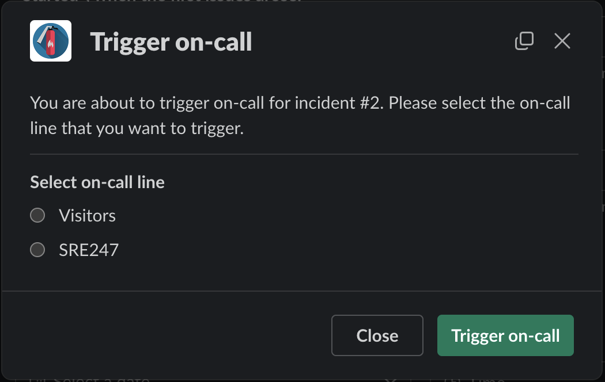



## Features

-   :fontawesome-brands-slack:{ .lg .middle } __Slack first__

    ---

    Don't leave Slack to manage incidents, and keep your team in the loop.

    <!-- [:octicons-arrow-right-24: Slack App](#) -->

    <!-- [:octicons-arrow-right-24: Getting started](#) -->

-   :simple-pagerduty:{ .lg .middle }  __Forward to PagerDuty__ _(optional)_

    ---

    Expose your on-call schedule, and allow anyone to escalate to PagerDuty.

    <!-- [:octicons-arrow-right-24: Reference](#) -->

-   :fontawesome-brands-jira:{ .lg .middle } __Follow on Jira__ _(optional)_

    ---

    Create a Jira ticket for the incident, and follow the incident from Jira.

-   :fontawesome-brands-confluence:{ .lg .middle } __Manage Confluence documents__ _(optional)_

    ---

    Automatically create a Post-mortem on Confluence, and sync your runbooks.

-   :fontawesome-solid-puzzle-piece:{ .lg .middle } __Extend with the API__

    ---

    Integrate with other systems, and extend the application with the API.

!!! warning "Young project disclaimer"

    FireFighter was only recently open-sourced, and is still a work in progress.

    While we are working on improving the documentation, and making the application more generic, there are still some caveats and FireFighter may not be ready for you yet.

    Python and Django knowledge is still recommended to install, configure and troubleshoot the application.

    Please open an issue if you have any question, or if you need help.

    The [FAQ](FAQ.md) may also answer some of your questions.

## Integrations

### PagerDuty

#### Features

Expose the current on-call schedule, and allow anyone to escalate to PagerDuty.

_Exposing the on-call schedule, even for users with no PagerDuty access._

_Trigger a PagerDuty incident from the Web UI, even with no PagerDuty access._

_In a Slack conversation about an incident, anyone can escalate to PagerDuty, with `/incident oncall`._

#### Tasks

Tasks are provided to regularly sync the on-call schedules, services and users from PagerDuty, as well as a task to trigger PagerDuty incidents.
<!-- See FIXME links to reference. -->\

If Confluence is enabled, there is a task to export the on-call schedule to a Confluence page set with `CONFLUENCE_ON_CALL_PAGE_ID`.

#### Settings and configuration

Basic ENV configuration.

No Back-Office configuration.

### Confluence

### Slack

#### Settings and configuration

See settings in [slack.py][firefighter.firefighter.settings.components.slack]

##### Back-Office configuration

You can add custom tags to Slack conversations in the back-office.

Some tags have special meaning:

- `tech_incidents`: send incidents notifications to the channel
- `dev_firefighter`: Where users can get help with the bot. Will be shown in `/incident help` for instance.
- `it_deploy`: Where the bot send notifications for deployment freezes.
