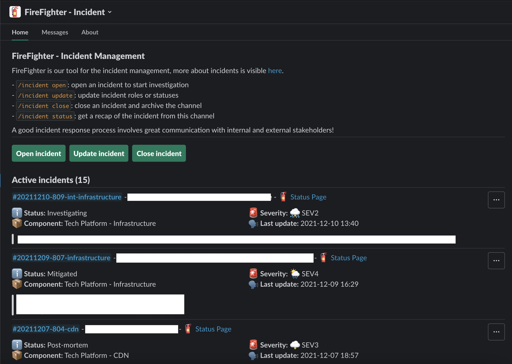

# Integrations

## :simple-pagerduty: PagerDuty

### Features

Expose the current on-call schedule, and allow anyone to escalate to PagerDuty.

_Exposing the on-call schedule, even for users with no PagerDuty access._

_Trigger a PagerDuty incident from the Web UI, even with no PagerDuty access._

_In a Slack conversation about an incident, anyone can escalate to PagerDuty, with `/incident oncall`._

### Tasks

Tasks are provided to regularly sync the on-call schedules, services and users from PagerDuty, as well as a task to trigger PagerDuty incidents.

If Confluence is enabled, there is a task to export the on-call schedule to a Confluence page set with environment variable `CONFLUENCE_ON_CALL_PAGE_ID`.

See the [available PagerDuty tasks][firefighter.pagerduty.tasks] that can be [scheduled from the Back-Office](../deploy/XX-tasks.md).

### Settings and configuration

[Basic configuration with environment variables](../deploy/XX-settings.md#pagerduty-integration).

No Back-Office configuration.

## :fontawesome-brands-confluence: Confluence

!!! warning
    This integration is disabled by default, and is not yet documented.
    It is specific to our internal use case.

## :fontawesome-brands-slack: Slack

### Features

Open, manage and close incidents from Slack. The whole lifecycle.

_See current incidents from Slack._

### Tasks

Tasks are provided to regularly sync users, conversations, usergroups and channel members from Slack.

See the [available Slack tasks][firefighter.slack.tasks] that can be [scheduled from the Back-Office](../deploy/XX-tasks.md).

### Settings and configuration

See [Slack environment variables settings](../deploy/XX-settings.md#slack-integration).

#### Back-Office configuration

##### Conversations tags

You can add custom tags to Slack conversations in the back-office.

Some tags have special meaning:

- `tech_incidents`: send incidents notifications to the channel
- `dev_firefighter`: Where users can get help with the bot. Will be shown in `/incident help` for instance.
- `it_deploy`: Where the bot send notifications for deployment freezes.

## User Group Management in Back-Office

You can **add** or **import user groups** in the back-office.

!!! note "Hint"
    When adding a usergroup in the BackOffice, you can put only its ID. The rest of the information will be fetched from Slack.

### How users are invited into an incident

Users are invited to incidents through a system that listens for invitation requests. For critical incidents, specific user groups are automatically included in the invitation process.

The system also checks if the incident is public or private, ensuring that only the appropriate users with Slack accounts are invited. This creates a complete list of responders from all connected platforms, making sure the right people are notified.

### Custom Invitation Strategy

For users looking to create a custom invitation strategy, here’s what you need to know:

- **Django Signals**: We use Django signals to manage invitations. You can refer to the [Django signals documentation](https://docs.djangoproject.com/en/4.2/topics/signals/) for more information.

- **Registering on the Signal**: You need to register on the [`get_invites`][firefighter.incidents.signals.get_invites] signal, which provides the incident object and expects to receive a list of [`users`][firefighter.slack.models.user].

- **Signal Example**: You can check one of our [signals][firefighter.slack.signals.get_users] for a concrete example.

!!! note "Tips"
    The signal can be triggered during the creation and update of an incident.
    Invitations will only be sent once all signals have responded. It is advisable to avoid API calls and to store data in the database beforehand.

##### SOSes

You can configure [SOSes][firefighter.slack.models.sos.Sos] in the back-office.

## :fontawesome-brands-jira: Jira

!!! warning
    This integration is disabled by default, and is not yet documented.
    It is specific to our internal use case.
